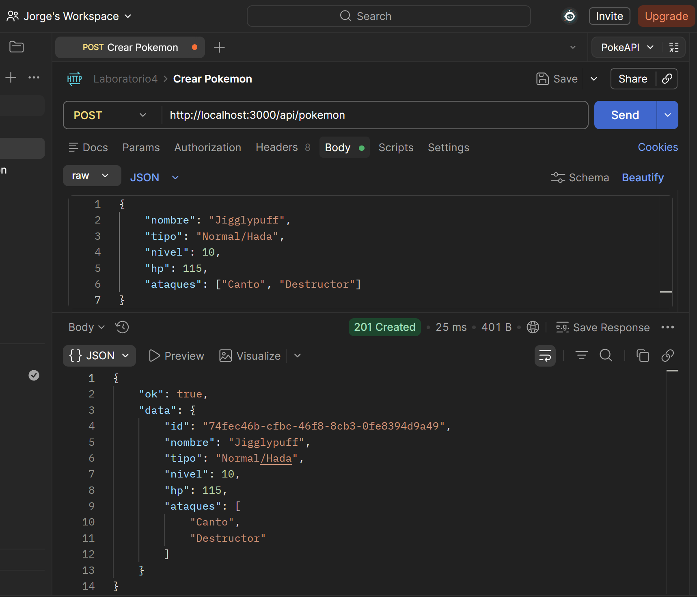
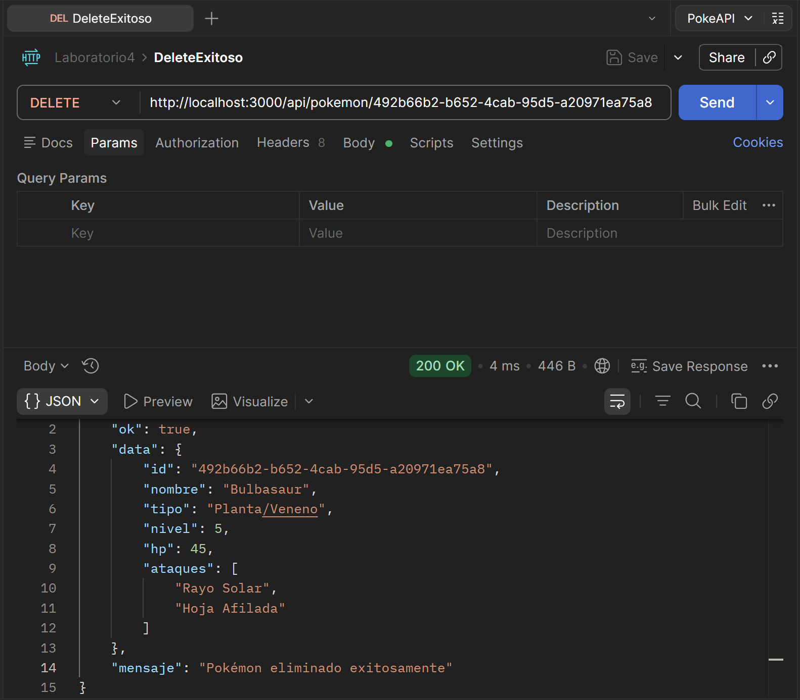
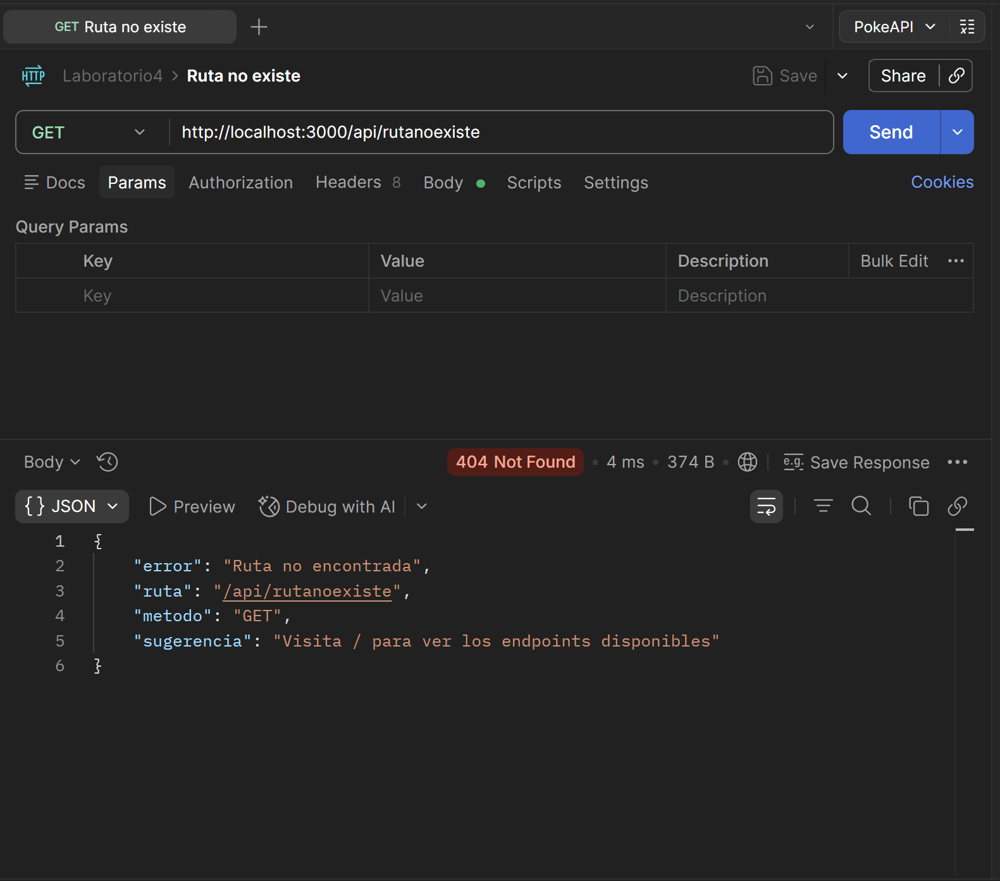
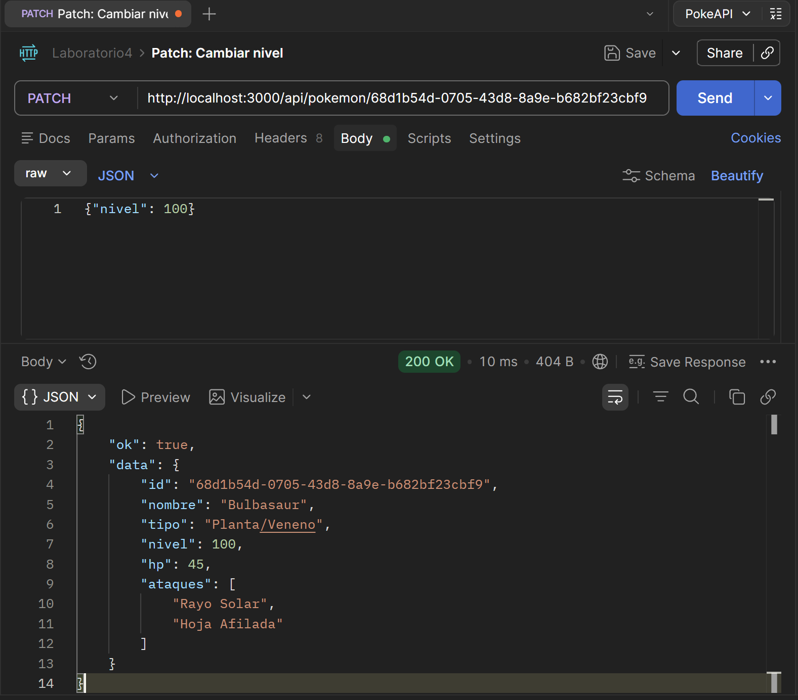
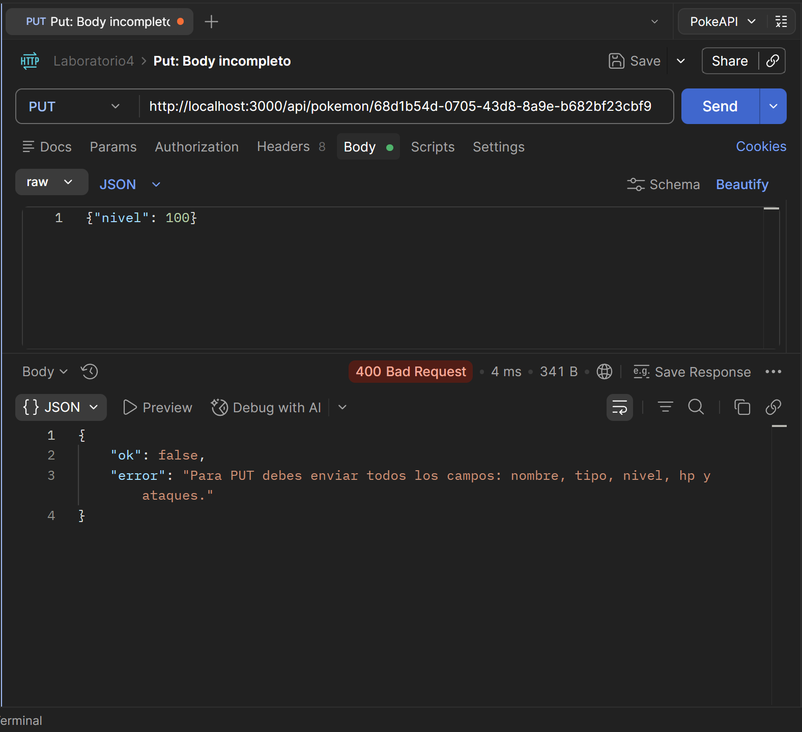
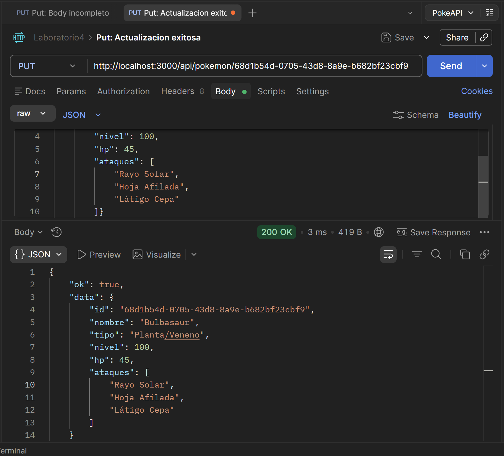

# Evidencia de Pruebas - API Pokédex

Documentación de las pruebas realizadas con Postman para validar los endpoints de la API Pokédex.

## Resumen de Pruebas

Se realizaron pruebas completas de CRUD (Create, Read, Update, Delete) en la API, validando:
- Creación de Pokémon
- Lectura de datos
- Actualización parcial con PATCH
- Actualización completa con PUT
- Eliminación de Pokémon
- Manejo de errores y validaciones

---

## 1. POST /api/pokemon - Crear Pokémon Exitoso

**Descripción**: Crear un nuevo Pokémon en la Pokédex

**Request Body**:
```json
{
  "nombre": "Jigglypuff",
  "tipo": "Normal/Hada",
  "nivel": 10,
  "hp": 115,
  "ataques": ["Canto", "Destructor"]
}
```

**Respuesta**:
- Status: `201 Created`
- El servidor asigna automáticamente un UUID único al Pokémon
- Se retornan todos los datos del Pokémon creado



---

## 2. DELETE /api/pokemon/{id} - Eliminación Exitosa

**Descripción**: Eliminar un Pokémon existente de la Pokédex

**Parámetro**: 
- ID: `492b66b2-b652-4cab-95d5-a20971ea75a8`

**Respuesta**:
- Status: `200 OK`
- Confirmación de eliminación
- Retorna los datos del Pokémon eliminado (Bulbasaur)
- Mensaje: "Pokémon eliminado exitosamente"



---

## 3. GET /api/rutaNoexiste - Ruta No Encontrada

**Descripción**: Intento acceder a un endpoint que no existe

**URL**: `http://localhost:3000/api/rutanooexiste`

**Respuesta**:
- Status: `404 Not Found`
- Mensaje de error: "Ruta no encontrada"
- Sugerencia: "Visita / para ver los endpoints disponibles"
- Ayuda al usuario a identificar rutas válidas



---

## 4. PATCH /api/pokemon/{id} - Cambiar Nivel

**Descripción**: Actualización parcial de un Pokémon (solo cambiar nivel)

**Parámetro**:
- ID: `68d1b54d-0705-43d8-8a9e-b682bf23cbf9`

**Request Body**:
```json
{
  "nivel": 100
}
```

**Respuesta**:
- Status: `200 OK`
- Solo se actualiza el campo especificado
- Los demás campos se mantienen intactos
- Retorna el Pokémon actualizado con el nuevo nivel



---

## 5. PUT /api/pokemon/{id} - Body Incompleto (Error)

**Descripción**: Intento de actualización completa sin incluir todos los campos requeridos

**Request Body (Incompleto)**:
```json
{
  "nivel": 100
}
```

**Respuesta**:
- Status: `400 Bad Request`
- Mensaje de error: "Para PUT debes enviar todos los campos..."
- Validación de campos requeridos



---

## 6. PUT /api/pokemon/{id} - Actualización Exitosa

**Descripción**: Actualización completa de un Pokémon

**Parámetro**:
- ID: `68d1b54d-0705-43d8-8a9e-b682bf23cbf9`

**Request Body (Completo)**:
```json
{
  "nombre": "Bulbasaur",
  "tipo": "Planta/Veneno",
  "nivel": 100,
  "hp": 45,
  "ataques": ["Rayo Solar", "Hoja Afilada", "Látigo Cepa"]
}
```

**Respuesta**:
- Status: `200 OK`
- Todos los campos se actualizan correctamente
- Se retorna el Pokémon actualizado
- Los nuevos datos reemplazan los anteriores



---

## Conclusiones

La API Pokédex implementa correctamente:
- Creación, lectura, actualización (parcial y completa) y eliminación
- Rechaza requests con datos incompletos con 400 Bad Request
- Responde con códigos HTTP apropiados
- Proporciona mensajes de ayuda (404 Not Found)
- Muestra códigos de estado HTTP correctos 200 OK, 201 Created, 400 Bad Request, 404 Not Found
