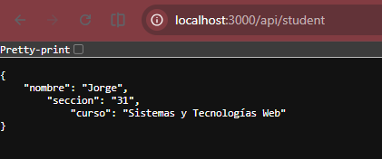

### Error 1: forma moderna ES modules
**Ubicación**: Extensión del archivo/Falta de package.json

**Tipo de error:** Sintaxis

**Qué estaba mal:** El archivo no estaba siendo tratado como ES Module

**Cómo lo corregí:** Agregue un package.json con type:module

**Por qué funciona ahora:** Ahora Node.js trata al archivo como un modulo, por lo que las imports funcionan correctamente.

### Error 2: falta ;
**Ubicacion**: En la linea const PORT = 3000

**Tipo de error:** Sintaxis

**Qué estaba mal:** Falta ;

**Cómo lo corregí:** Agregue el ; faltante

**Por qué funciona ahora:** Ahora termina la linea correctamente y se procede a crear la variable server. 

### Error 3 y 4: falta );
**Ubicacion**: En la linea server.listen(PORT, () => {
  console.log("Servidor corriendo en http://localhost:3000")
} y tambien en la linea const server = http.createServer(async (req, res) => { 

**Tipo de error:** Sintaxis

**Qué estaba mal:** Falta cerrar el parentesis de los argumentos, y agregar el ;. 

**Cómo lo corregí:** Agregue el ); faltante

**Por qué funciona ahora:** Al corregir el error de sintaxis se llama la funcion correctamente

### Error 5 
**Ubicacion**: En la linea { "Content-Type": "application-json" })

**Tipo de error:**  protocolo HTTP

**Qué estaba mal:** Tiene - en vez de /

**Cómo lo corregí:** Reemplace el caracter

**Por qué funciona ahora:** Ahora usa el tipo correcto

### Error 6
**Ubicacion**: En la linea res.writeHead(200, { "Content-Type": "text/plain" })
  res.end("Ruta no encontrada")

**Tipo de error:** respuesta

**Qué estaba mal:** Usa 200 para una respuesta fallida de no encontrada en vez de 404

**Cómo lo corregí:** Lo cambie a 404

**Por qué funciona ahora:** Usa el codigo de error correcto

### Error 7 
**Ubicacion**: JSON.stringify(texto)

**Tipo de error:** Lógica

**Qué estaba mal:** Se esta usando stringify con un archivo que ya es un archivo json

**Cómo lo corregí:** Simplemente le pase texto como argumento

**Por qué funciona ahora:** Ya no agrega caracteres adicionales por esta conversion adicional

 ### Error 8
**Ubicacion**: const texto = fs.readFile(filePath, "utf-8")

**Tipo de error:** Asincronía

**Qué estaba mal:** No tiene el await 

**Cómo lo corregí:** Le agregue el await faltante ya que la funcion es asincrona

**Por qué funciona ahora:** Ahora espera a que el archivo este disponible antes de continuar

### Ahora ya funciona el server:
